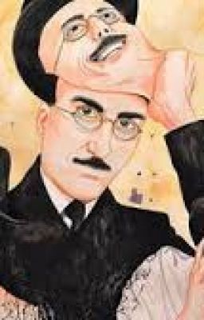

<h2 align="center">
Poeta Fingidor
</h2>
<h4 align=center><em>Por:</em> Fernando Pessoa</h4>
 

O poeta é um fingidor 
Finge tão completamente 
Que chega a fingir que é dor 
A dor que deveras sente.

E os que lêem o que escreve, 
Na dor lida sentem bem, 
Não as duas que ele teve, 
Mas só a que eles não têm.

E assim nas calhas de roda 
Gira, a entreter a razão, 
Esse comboio de corda 
Que se chama coração.

 
 

 
 

<h3 align="center">Saiba Mais:</h3>

    
    

